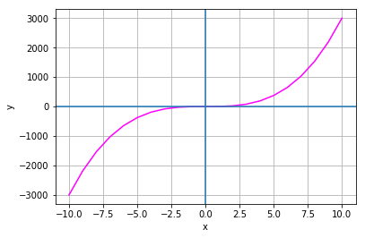
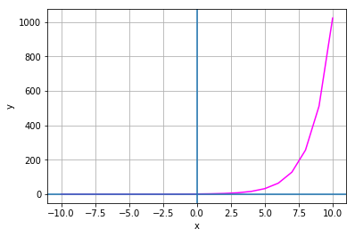
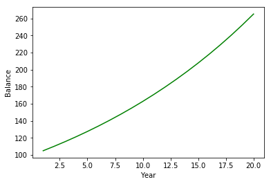

# Exponentials, Radicals, and Logs
Up to this point, all of our equations have included standard arithmetic operations, such as division, multiplication, addition, and subtraction. Many real-world calculations involve exponential values in which numbers are raised by a specific power.

## Exponentials
A simple case of of using an exponential is squaring a number; in other words, multipying a number by itself. For example, 2 squared is 2 times 2, which is 4. This is written like this:

\begin{equation}2^{2} = 2 \cdot 2 = 4\end{equation}

Similarly, 2 cubed is 2 times 2 times 2 (which is of course 8):

\begin{equation}2^{3} = 2 \cdot 2 \cdot 2 = 8\end{equation}

In Python, you use the **&ast;&ast;** operator, like this example in which **x** is assigned the value of 5 raised to the power of 3 (in other words, 5 x 5 x 5, or 5-cubed):


```python
x = 5**3
print(x)
```

    125
    

Multiplying a number by itself twice or three times to calculate the square or cube of a number is a common operation, but you can raise a number by any exponential power. For example, the following notation shows 4 to the power of 7 (or 4 x 4 x 4 x 4 x 4 x 4 x 4), which has the value:

\begin{equation}4^{7} = 16384 \end{equation}

In mathematical terminology, **4** is the *base*, and **7** is the *power* or *exponent* in this expression.

## Radicals (Roots)
While it's common to need to calculate the solution for a given base and exponential, sometimes you'll need to calculate one or other of the elements themselves. For example, consider the following expression:

\begin{equation}?^{2} = 9 \end{equation}

This expression is asking, given a number (9) and an exponent (2), what's the base? In other words, which number multipled by itself results in 9? This type of operation is referred to as calculating the *root*, and in this particular case it's the *square root* (the base for a specified number given the exponential **2**). In this case, the answer is 3, because 3 x 3 = 9. We show this with a **&radic;** symbol, like this:

\begin{equation}\sqrt{9} = 3 \end{equation}

Other common roots include the *cube root* (the base for a specified number given the exponential **3**). For example, the cube root of 64 is 4 (because 4 x 4 x 4 = 64). To show that this is the cube root, we include the exponent **3** in the **&radic;** symbol, like this:

\begin{equation}\sqrt[3]{64} = 4 \end{equation}

We can calculate any root of any non-negative number, indicating the exponent in the **&radic;** symbol.

The **math** package in Python includes a **sqrt** function that calculates the square root of a number. To calculate other roots, you need to reverse the exponential calculation by raising the given number to the power of 1 divided by the given exponent:


```python
import math

# Calculate square root of 25
x = math.sqrt(25)
print (x)

# Calculate cube root of 64
cr = round(64 ** (1. / 3))
print(cr)
```

    5.0
    4
    

The code used in Python to calculate roots other than the square root reveals something about the relationship between roots and exponentials. The exponential root of a number is the same as that number raised to the power of 1 divided by the exponential. For example, consider the following statement:

\begin{equation} 8^{\frac{1}{3}} = \sqrt[3]{8} = 2 \end{equation}

Note that a number to the power of 1/3 is the same as the cube root of that number.

Based on the same arithmetic, a number to the power of 1/2 is the same as the square root of the number:

\begin{equation} 9^{\frac{1}{2}} = \sqrt{9} = 3 \end{equation}

You can see this for yourself with the following Python code:


```python
import math

print (9**0.5)
print (math.sqrt(9))
```

    3.0
    3.0
    

## Logarithms
Another consideration for exponential values is the requirement occassionally to determine the exponent for a given number and base. In other words, how many times do I need to multiply a base number by itself to get the given result. This kind of calculation is known as the *logarithm*.

For example, consider the following expression:

\begin{equation}4^{?} = 16 \end{equation}

In other words, to what power must you raise 4 to produce the result 16?

The answer to this is 2, because 4 x 4 (or 4 to the power of 2) = 16. The notation looks like this:

\begin{equation}log_{4}(16) = 2 \end{equation}

In Python, you can calculate the logarithm of a number using the **log** function in the **math** package, indicating the number and the base:


```python
import math

x = math.log(16, 4)
print(x)
```

    2.0
    

The final thing you need to know about exponentials and logarithms is that there are some special logarithms:

The *common* logarithm of a number is its exponential for the base **10**. You'll occassionally see this written using the usual *log* notation with the base omitted:

\begin{equation}log(1000) = 3 \end{equation}

Another special logarithm is something called the *natural log*, which is a exponential of a number for base ***e***, where ***e*** is a constant with the approximate value 2.718. This number occurs naturally in a lot of scenarios, and you'll see it often as you work with data in many analytical contexts. For the time being, just be aware that the natural log is sometimes written as ***ln***:

\begin{equation}log_{e}(64) = ln(64) = 4.1589 \end{equation}

The **math.log** function in Python returns the natural log (base ***e***) when no base is specified. Note that this can be confusing, as the mathematical notation *log* with no base usually refers to the common log (base **10**). To return the common log in Python, use the **math.log10** function:


```python
import math

# Natural log of 29
print (math.log(29))

# Common log of 100
print(math.log10(100))
```

    3.367295829986474
    2.0
    

## Solving Equations with Exponentials
OK, so now that you have a basic understanding of exponentials, roots, and logarithms; let's take a look at some equations that involve exponential calculations.

Let's start with what might at first glance look like a complicated example, but don't worry - we'll solve it step-by-step and learn a few tricks along the way:

\begin{equation}2y = 2x^{4} ( \frac{x^{2} + 2x^{2}}{x^{3}} ) \end{equation}

First, let's deal with the fraction on the right side. The numerator of this fraction is x<sup>2</sup> + 2x<sup>2</sup> - so we're adding two exponential terms. When the terms you're adding (or subtracting) have the same exponential, you can simply add (or subtract) the coefficients. In this case, x<sup>2</sup> is the same as 1x<sup>2</sup>, which when added to 2x<sup>2</sup> gives us the result 3x<sup>2</sup>, so our equation now looks like this: 

\begin{equation}2y = 2x^{4} ( \frac{3x^{2}}{x^{3}} ) \end{equation}

Now that we've condolidated the numerator, let's simplify the entire fraction by dividing the numerator by the denominator. When you divide exponential terms with the same variable, you simply divide the coefficients as you usually would and subtract the exponential of the denominator from the exponential of the numerator. In this case, we're dividing 3x<sup>2</sup> by 1x<sup>3</sup>: The coefficient 3 divided by 1 is 3, and the exponential 2 minus 3 is -1, so the result is 3x<sup>-1</sup>, making our equation:

\begin{equation}2y = 2x^{4} ( 3x^{-1} ) \end{equation}

So now we've got rid of the fraction on the right side, let's deal with the remaining multiplication. We need to multiply 3x<sup>-1</sup> by 2x<sup>4</sup>. Multiplication, is the opposite of division, so this time we'll multipy the coefficients and add the exponentials: 3 multiplied by 2 is 6, and -1 + 4 is 3, so the result is 6x<sup>3</sup>:

\begin{equation}2y = 6x^{3} \end{equation}

We're in the home stretch now, we just need to isolate y on the left side, and we can do that by dividing both sides by 2. Note that we're not dividing by an exponential, we simply need to divide the whole 6x<sup>3</sup> term by two; and half of 6 times x<sup>3</sup> is just 3 times x<sup>3</sup>:

\begin{equation}y = 3x^{3} \end{equation}

Now we have a solution that defines y in terms of x. We can use Python to plot the line created by this equation for a set of arbitrary *x* and *y* values:


```python
import pandas as pd

# Create a dataframe with an x column containing values from -10 to 10
df = pd.DataFrame ({'x': range(-10, 11)})

# Add a y column by applying the slope-intercept equation to x
df['y'] = 3*df['x']**3

#Display the dataframe
print(df)

# Plot the line
%matplotlib inline
from matplotlib import pyplot as plt

plt.plot(df.x, df.y, color="magenta")
plt.xlabel('x')
plt.ylabel('y')
plt.grid()
plt.axhline()
plt.axvline()
plt.show()
```

         x     y
    0  -10 -3000
    1   -9 -2187
    2   -8 -1536
    3   -7 -1029
    4   -6  -648
    5   -5  -375
    6   -4  -192
    7   -3   -81
    8   -2   -24
    9   -1    -3
    10   0     0
    11   1     3
    12   2    24
    13   3    81
    14   4   192
    15   5   375
    16   6   648
    17   7  1029
    18   8  1536
    19   9  2187
    20  10  3000
    





Note that the line is curved. This is symptomatic of an exponential equation: as values on one axis increase or decrease, the values on the other axis scale *exponentially* rather than *linearly*.

Let's look at an example in which x is the exponential, not the base:

\begin{equation}y = 2^{x} \end{equation}

We can still plot this as a line:


```python
import pandas as pd

# Create a dataframe with an x column containing values from -10 to 10
df = pd.DataFrame ({'x': range(-10, 11)})

# Add a y column by applying the slope-intercept equation to x
df['y'] = 2.0**df['x']

#Display the dataframe
print(df)

# Plot the line
%matplotlib inline
from matplotlib import pyplot as plt

plt.plot(df.x, df.y, color="magenta")
plt.xlabel('x')
plt.ylabel('y')
plt.grid()
plt.axhline()
plt.axvline()
plt.show()
```

         x            y
    0  -10     0.000977
    1   -9     0.001953
    2   -8     0.003906
    3   -7     0.007812
    4   -6     0.015625
    5   -5     0.031250
    6   -4     0.062500
    7   -3     0.125000
    8   -2     0.250000
    9   -1     0.500000
    10   0     1.000000
    11   1     2.000000
    12   2     4.000000
    13   3     8.000000
    14   4    16.000000
    15   5    32.000000
    16   6    64.000000
    17   7   128.000000
    18   8   256.000000
    19   9   512.000000
    20  10  1024.000000
    





Note that when the exponential is a negative number, Python reports the result as 0. Actually, it's a very small fractional number, but because the base is positive the exponential number will always positive. Also, note the rate at which y increases as x increases - exponential growth can be be pretty dramatic.

So what's the practical application of this?

Well, let's suppose you deposit $100 in a bank account that earns 5&#37; interest per year. What would the balance of the account be in twenty years, assuming you don't deposit or withdraw any additional funds?

To work this out, you could calculate the balance for each year:

After the first year, the balance will be the initial deposit ($100) plus 5&#37; of that amount:

\begin{equation}y1 = 100 + (100 \cdot 0.05) \end{equation}

Another way of saying this is:

\begin{equation}y1 = 100 \cdot 1.05 \end{equation}

At the end of year two, the balance will be the year one balance plus 5&#37;:

\begin{equation}y2 = 100 \cdot 1.05 \cdot 1.05 \end{equation}

Note that the interest for year two, is the interest for year one multiplied by itself - in other words, squared. So another way of saying this is:

\begin{equation}y2 = 100 \cdot 1.05^{2} \end{equation}

It turns out, if we just use the year as the exponent, we can easily calculate the growth after twenty years like this:

\begin{equation}y20 = 100 \cdot 1.05^{20} \end{equation}

Let's apply this logic in Python to see how the account balance would grow over twenty years:


```python
import pandas as pd

# Create a dataframe with 20 years
df = pd.DataFrame ({'Year': range(1, 21)})

# Calculate the balance for each year based on the exponential growth from interest
df['Balance'] = 100 * (1.05**df['Year'])

#Display the dataframe
print(df)

# Plot the line
%matplotlib inline
from matplotlib import pyplot as plt

plt.plot(df.Year, df.Balance, color="green")
plt.xlabel('Year')
plt.ylabel('Balance')
plt.show()
```

        Year     Balance
    0      1  105.000000
    1      2  110.250000
    2      3  115.762500
    3      4  121.550625
    4      5  127.628156
    5      6  134.009564
    6      7  140.710042
    7      8  147.745544
    8      9  155.132822
    9     10  162.889463
    10    11  171.033936
    11    12  179.585633
    12    13  188.564914
    13    14  197.993160
    14    15  207.892818
    15    16  218.287459
    16    17  229.201832
    17    18  240.661923
    18    19  252.695020
    19    20  265.329771
    




